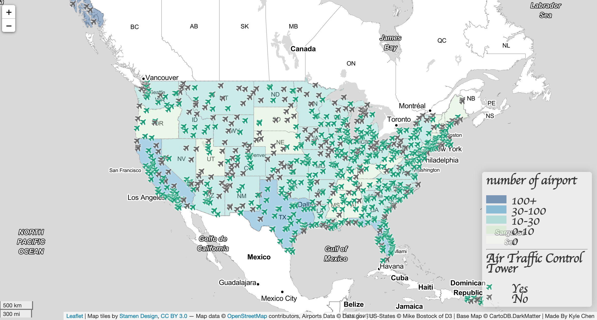

# us airports map
The map indicates the number of airports in each state within the US, and also showing whether each of the airports has an air traffic control tower or not.

### Functions
- clickable marker (airport name will show up)
- different colors are used for each airport to help distinguish whether it has an air traffic control tower
- a scale bar is implemented

### Libraries
- icon: https://fontawesome.com/
- basemap: https://leaflet-extras.github.io/leaflet-providers/preview/

### Data Sources
- airports.geojson : https://catalog.data.gov/dataset/usgs-small-scale-dataset-airports-of-the-united-states-201207-shapefile
- us-states.geojson : https://bost.ocks.org/mike/ & https://d3js.org/

### Credit
Tutorial provided by:
**Professor Zhao** from the University of Washington, Department of Geography
